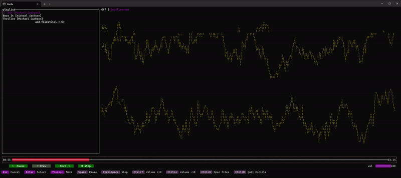

<div align="center">
  
</div>

<div align="center">
  
  
  
</div>

# Oscilla

A lightweight terminal-based music player for Windows, built with Rust and Ratatui.

Oscilla is designed for local audio playback and smooth, high-quality visual effects at up to 60 FPS.

## Demo



## Features

- Play local audio files
- Display smooth, high-quality visualizations at up to 60 FPS (currently, only an oscilloscope is available)
- Control almost the entire app using only the arrow, Enter, and Esc keys, making it easy to use even if you are unfamiliar with terminal applications
- Support common audio formats such as MP3, WAV, FLAC, OGG, AAC, and more

## Usage

### Requirements

- Windows 11
- Windows 10 (the legacy Console Host is not supported; Windows Terminal must be installed and used to run Oscilla)

#### Tested Terminal

- Windows Terminal

### Download a release

Download the latest binary from the GitHub Releases page and run it directly:

```bash
Oscilla.exe
```

You can also open files directly from the binary:

```bash
Oscilla.exe path\to\song.mp3 path\to\album.flac
```

### Keyboard controls

- Space: Play or pause playback
- Ctrl + Space: Stop
- Ctrl + Up: Volume +10
- Ctrl + Down: Volume -10
- Ctrl + O: Open files
- Ctrl + D: Quit Oscilla
- Arrow keys: Navigate the interface
- Enter: Activate a selected item
- Esc: Cancel or exit a focused state

## Supported audio formats

Supported number of channels:

- mono
- stereo

Supported file sampling rates:

- 44.1kHz
- 48kHz
- 88.2kHz
- 176.4kHz
- 192kHz

Supported audio device sampling rates:

- 44.1kHz
- 48kHz
- 88.2kHz
- 176.4kHz
- 192kHz

The app currently accepts files with the following extensions:

- aif, aiff, caf, mp4, m4a, m4p, m4b, m4r, m4v, mov, mkv, webm, ogg, wav, aac, flac, mp1, mp2, mp3, mpa, opus, wv


## Building from source

### Requirements

- Windows 10 or newer
- Rust stable toolchain
- Cargo

### Build from source

```bash
git clone https://github.com/<your-username>/Oscilla.git
cd Oscilla
cargo build --release
```

The executable is produced in the release output folder, typically:

```bash
target\release\Oscilla.exe
```

### Run from source

```bash
cargo run --release
```


## License

Oscilla's original source code is licensed under the MIT License. See the [LICENSE](LICENSE) file for the full license text.

The project uses third-party dependencies distributed under their respective licenses. Those license terms and notices remain applicable, including the Mozilla Public License 2.0 for Symphonia.